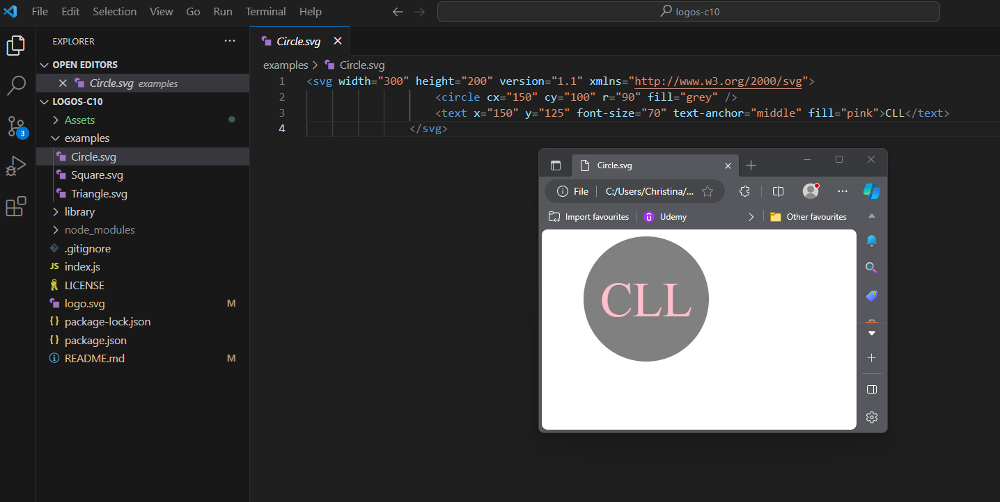
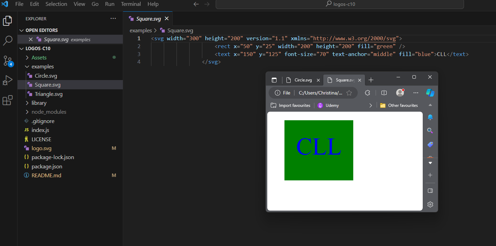
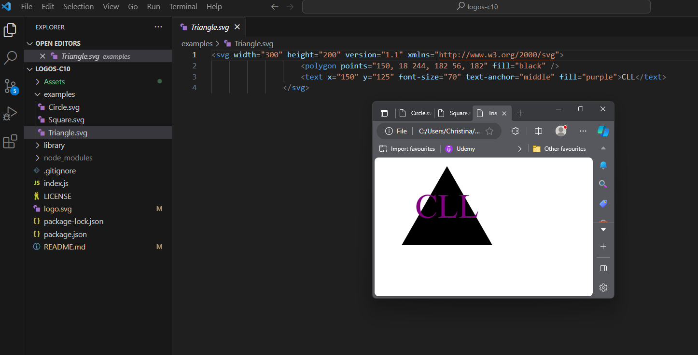

# Simple Logo Generator with SVG

Google Drive link to usage video: [Logo-C10 Christina Larsen](https://drive.google.com/file/d/1OTfqMQZ_uwjDE1f3j-wkAyLt2dpVR5Tf/view)

## Table of Contents (Optional)

* [Installation](#installation)
* [Usage](#usage)
* [Credits](#credits)
* [License](#license)

## Installation

You will need to run this app from [Visual Studio Code](https://code.visualstudio.com/). Once you have it open you will need to use the Intergrated Terminal:
1. Install [Node.js](https://nodejs.org/en)
2. Use NPM to install [Inquirer Version 8.2.4](https://www.npmjs.com/package/inquirer/v/8.2.4) and [fs.writeFile](https://nodejs.org/api/fs.html#fswritefilefile-data-options-callback)

Next you can run the app with Node by typing in [node index.js]. Answer the content questions and a file name logo.svg will be generated using your answers.

## Usage 

1.	Make sure all requirements have been installed.
2.	Answer the five questions:
        * Text for the logo cannot be more than 3 characters.
        * The color can be entered with a simple keyword or a hexadecimal.
        * Use arrow keys to move the selection up/down to pick from the 3 types of shapes.
3.	Enter the logo file name or hit enter to choose the default file name of [logo.svg].
4.	The logo is generated when you see “SVG saved to logo.svg (or the file name you entered).
5.	Save the file to local storage to access it when needed.

## Credits

| Git | [https://git-scm.com/](https://git-scm.com/) |    
| Javascript | [https://developer.mozilla.org/en-US/docs/Web/JavaScript](https://developer.mozilla.org/en-US/docs/Web/JavaScript) |
| jQuery | [https://jquery.com](https://jquery.com) |
| Node.js | [https://nodejs.org/en](https://nodejs.org/en) |
| Inquirer Version 8.2.4 | [https://www.npmjs.com/package/inquirer/v/8.2.4](https://www.npmjs.com/package/inquirer/v/8.2.4) |

## License

[MIT License](https://github.com/microsoft/vscode/blob/main/LICENSE.txt)

